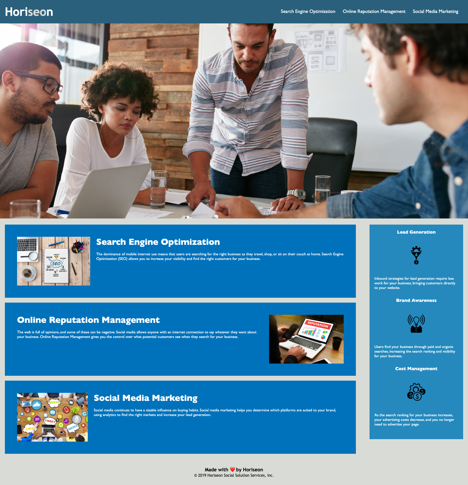

Horiseon SEO 

The purpose of this project was to make the website meet accessibillity standards, while also cleaning up code.

What I did-
  Created alt definitions for all photos
  Compressed CSS by creating classes to make code more consice
  Added symantics to HTML
  Assured all links went to correct location
  
  

